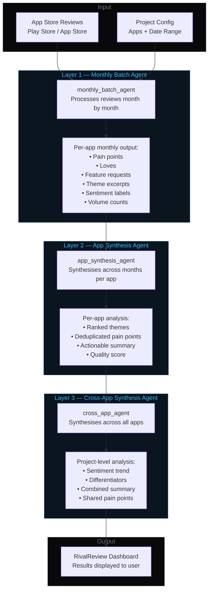
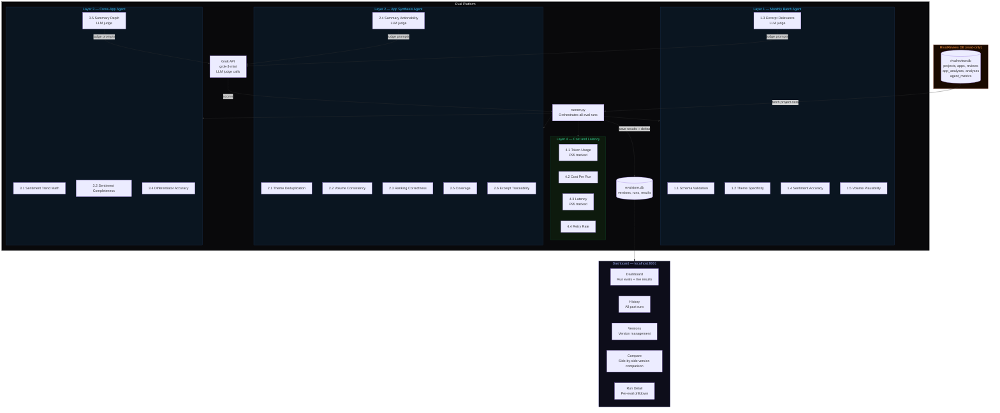
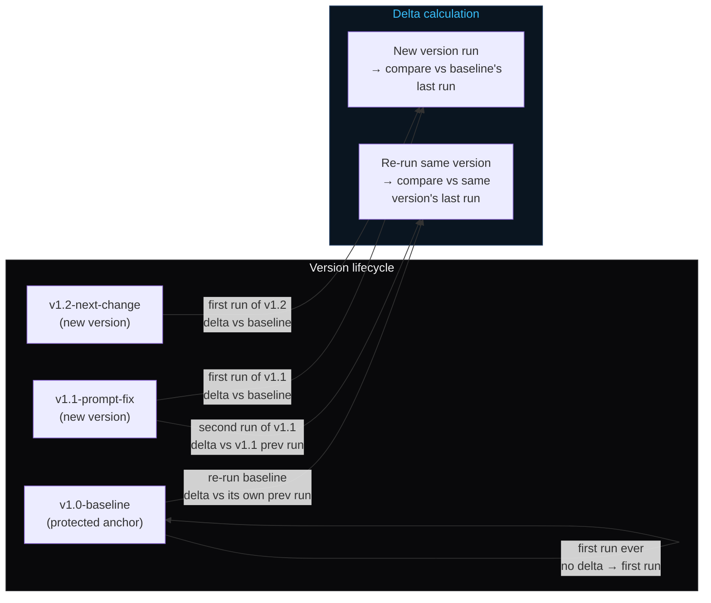

# Architecture

This document covers two things: how the RivalReview AI pipeline works, and how the eval platform monitors it.

---

## 1. RivalReview Pipeline

RivalReview processes app store reviews through three sequential AI agents. Each agent is independently evaluated by the eval platform.



---

## 2. Eval Platform Architecture

The eval platform sits alongside RivalReview, reads its database read-only, and runs quality checks against the pipeline outputs.



---

## 3. Delta and Versioning Model



---

## 4. Data flow summary

| Step | What happens |
|------|-------------|
| User clicks Run All Evals | `POST /run` → `runner.run_all()` |
| Runner fetches data | Reads `rivalreview.db` for the selected project |
| Runner fetches previous scores | Finds baseline's last run for delta comparison |
| Each eval runs | Returns `EvalResult.to_dict()` with score, details, pass/fail |
| Layer 4 evals | Also compute P95/avg/min/max from `agent_metrics` table |
| LLM judge evals | Call Grok API with eval prompt, parse score from response |
| Results saved | Written to `evalstore.db` with delta, criteria, metrics JSON |
| Dashboard renders | Reads from `evalstore.db`, displays per-layer results with deltas |

---

## 5. Eval result structure

Every eval returns a standard dict defined in `evals/base.py`:

```
EvalResult
├── eval_id       "1.2"
├── name          "Theme Specificity"
├── layer         1
├── score         0.99          ← ratio 0.0–1.0
├── threshold     0.90          ← from config.py THRESHOLDS
├── passed_eval   true          ← score >= threshold
├── passed        47            ← count of passing items
├── failed        1             ← count of failing items
├── criteria      "≥90% of themes must be specific..."
├── delta         { prev: 99, curr: 99, direction: "neutral" }
├── metrics       { p95, avg, min, max }  ← layer 4 only
└── details       [ { item_id, passed, note }, ... ]
```
